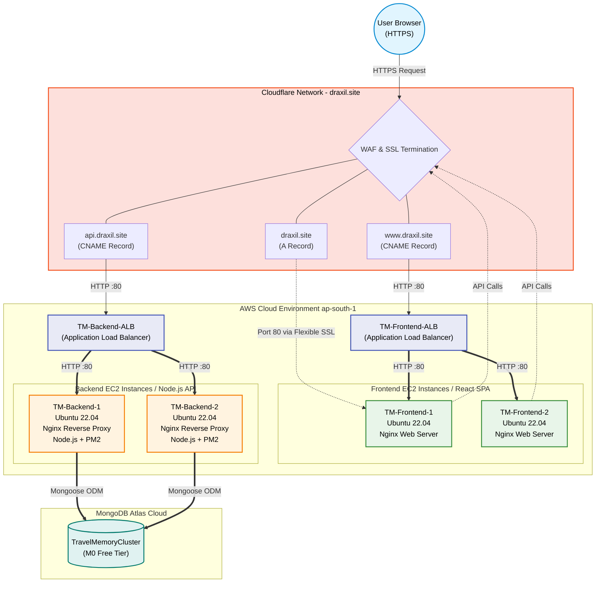

```mermaid
graph TD
    %% Styling Classes
    classDef user fill:#e1f5fe,stroke:#0288d1,stroke-width:2px,color:#000
    classDef cloudflare fill:#fde0dc,stroke:#f4511e,stroke-width:2px,color:#000
    classDef awsALB fill:#e8eaf6,stroke:#3f51b5,stroke-width:2px,color:#000
    classDef ec2Front fill:#e8f5e9,stroke:#388e3c,stroke-width:2px,color:#000
    classDef ec2Back fill:#fff3e0,stroke:#f57c00,stroke-width:2px,color:#000
    classDef mongo fill:#e0f2f1,stroke:#00796b,stroke-width:2px,color:#000

    %% User Layer
    User(("User Browser<br>(HTTPS)")):::user

    %% Cloudflare Layer
    subgraph CF [Cloudflare Network - draxil.site]
        direction TB
        WAF{"WAF & SSL Termination"}
        DNS_Root["draxil.site<br>(A Record)"]
        DNS_WWW["www.draxil.site<br>(CNAME Record)"]
        DNS_API["api.draxil.site<br>(CNAME Record)"]
        
        WAF --- DNS_Root
        WAF --- DNS_WWW
        WAF --- DNS_API
    end
    class CF cloudflare

    %% AWS Network
    subgraph AWS [AWS Cloud Environment ap-south-1]
        direction TB
        
        %% Load Balancers
        ALB_FE["TM-Frontend-ALB<br>(Application Load Balancer)"]:::awsALB
        ALB_BE["TM-Backend-ALB<br>(Application Load Balancer)"]:::awsALB

        %% Frontend Instances
        subgraph FE_Instances [Frontend EC2 Instances / React SPA]
            direction LR
            FE1["TM-Frontend-1<br>Ubuntu 22.04<br>Nginx Web Server"]:::ec2Front
            FE2["TM-Frontend-2<br>Ubuntu 22.04<br>Nginx Web Server"]:::ec2Front
        end

        %% Backend Instances
        subgraph BE_Instances [Backend EC2 Instances / Node.js API]
            direction LR
            BE1["TM-Backend-1<br>Ubuntu 22.04<br>Nginx Reverse Proxy<br>Node.js + PM2"]:::ec2Back
            BE2["TM-Backend-2<br>Ubuntu 22.04<br>Nginx Reverse Proxy<br>Node.js + PM2"]:::ec2Back
        end
    end

    %% Database Layer
    subgraph DB [MongoDB Atlas Cloud]
        MongoCluster[("TravelMemoryCluster<br>(M0 Free Tier)")]:::mongo
    end

    %% Connections & Traffic Flow
    User -->|HTTPS Request| WAF
    
    DNS_Root -.->|Port 80 via Flexible SSL| FE1
    DNS_WWW -->|HTTP :80| ALB_FE
    DNS_API -->|HTTP :80| ALB_BE

    ALB_FE ==>|HTTP :80| FE1
    ALB_FE ==>|HTTP :80| FE2

    ALB_BE ==>|HTTP :80| BE1
    ALB_BE ==>|HTTP :80| BE2

    FE1 -.->|API Calls| WAF
    FE2 -.->|API Calls| WAF

    BE1 ==>|Mongoose ODM| MongoCluster
    BE2 ==>|Mongoose ODM| MongoCluster
```
